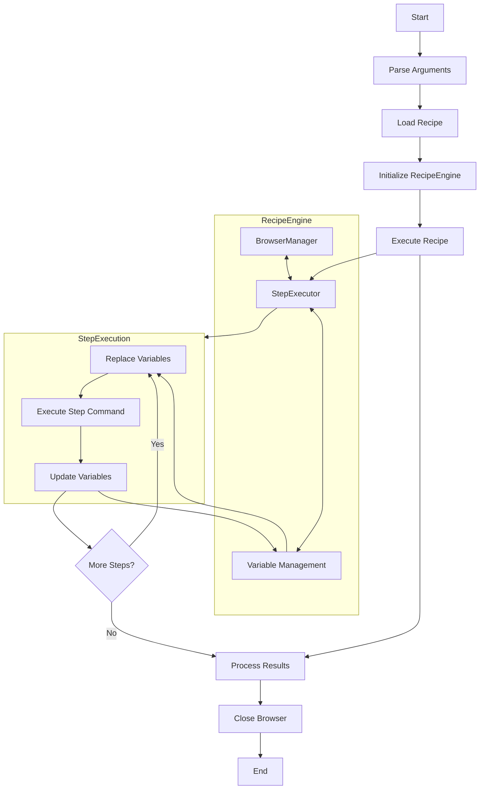

<a href="https://listy.is">
    
</a>

# Listy's RecipeKit
Listy is a mobile app that allows you to keep track of your favorite things in a private and organized manner. The app lets you create lists to store your favorite movies, books, TV shows, links, video games, and wines all in one place. With Listy, you can easily manage and track your favorite things without having to navigate multiple apps or websites.

<p float="center">
<a href="https://listy.is/download/ios"></a>
<a href="https://listy.is/download/android"></a>
</p>

This public GitHub repository contains the recipes that enable the app to load information from different internet sources, this code is **open** and allows you to collaborate and integrate new content providers for Lisy using our guides and tools.

## About

This RecipeKit is a step based system for dynamic scrapping that guides the App in the process of extracting information from different webpages to enrich your content in Listy.

This proposal is based on *Selenium IDE*, the web testing tool, and uses some of its commands.

### Understanding Recipes in Listy

In Listy, a recipe is a step-by-step process that enables the app to extract relevant information of a particular type from any websites. These recipes guide the app to obtain the desired data and seamlessly add it to your lists, making the process automated and effortless.

This GitHub repository contains folders that categorize different types of content, such as movies, anime, books, beers, and more. Within each folder, you'll find JSON files, which represent individual recipes for extracting information of the corresponding type from a specific online resource. For instance, the "Movies" folder may include recipes for popular websites like IMDb, TMDb, and Filmaffinity.

### How do Recipes work?

Recipes in Listy are comprised of a series of commands that allow the app to extract the information. These instructions guide the app in navigating to a website, identifying and clicking specific elements, and extracting relevant text to add to your lists. With these recipes in place, adding new items to your list is a simple and streamlined process, as the app automatically gathers the necessary information without you having to manually search multiple websites.

## Contributing

We're thrilled to welcome you to the Listy community of developers! With your contributions, we can continue to provide a platform that helps users keep track of their favorite things in the most flexible and efficient way possible.

Creating new recipes for Listy is a great way to show your support for the project and make it even better. If you encounter any issues while using Listy, we would be grateful if you could share your feedback with us by submitting a detailed issue.

If you're ready to start contributing, simply head to our repository and create a pull request with your new recipe. Our team will review your contribution as soon as possible and provide feedback if needed.

Don't be afraid to reach out to us if you have any questions or suggestions. We're here to help and look forward to working together to make Listy even better!

# Implementation details

Each recipe contains a set of instructions that have single responsibility for extracting information from specific websites or internet sources. his allows for automated data gathering and addition to lists.

## Recipe Properties

- `list_type`: Defines the relationship between the recipe and the content type (e.g. movie)
- `title`: The title of the recipe.
- `description`: Describes the purpose and details of the recipe.
- `engine_version`: Ensures compatibility with different iterations, not all the engines support all the commands and all the content types.
- `url_available`: An array of URLs where the recipe is able to extract data.
- `autocomplete_steps`: a.k.a search commands. The array of `commands` used to list related content. It should enumerate content that match the user input.
- `url_steps`: The array of `commands` used to retrieve all the specific information and hydrate an speciffic item, starting from a URL.

### autocomplete_steps
The commands in this array returns to the app a list of resiuls (usually from 5 to 10) that represent content related with the `INPUT` query which is a `string`. This steps are used by the app in the add item screen of each list. And the list of properties needed are:

- `URLn`: **mandatory** The URL that will trigger the `url_steps` to fetch the content.
- `TITLEn`: **mandatory** The distinct name/title of the content.
- `SUBTITLEn`: **optional** A piece of additional info, could be a year on a movie, the author of the book, whatever short information you consider relevant to disambiguate the list of results.
- `COVERn`: **optional** An URL to a image representing the content.

*Being index the enumerator of the result: URL1, URL2, URL3 will be related to TITLE1, TITLE2 and TITLE3.**
It is very usefull to avoid repetition and copy paseing command to include loop instruction in the `config` of each command. 

```json
    {
      "command": "store_attribute",
      "locator": "[itemtype='http://schema.org/Book']:eq($i)",
      "attribute_name": "href",
      "config": {
        "loop": {
          "index": "i",
          "from": 0,
          "to": 5,
          "step": 1
        }
      },
      "output": {
        "name": "URL$i"
      },
      "description": "Saves the absolute book url"
    },
```

This JSON structure is for a `store_attribute` command that retrieves the href attribute from a book element (itemtype='http://schema.org/Book') in a list and stores it as a variable. The command is executed in a loop, from 0 to 4, using the index i to replace the $i placeholder in the locator and output.name fields. The result is five variables named URL0, URL1, URL2, URL3, and URL4 that store the URLs of five books in the list.

### url_steps
The commands in this array fetch all the information realted to a speciffic piece of content, the `INPUT` of the recipe is an `URL` containing the info related to the content. This URL must match the pattern specified on the attribute `url_available` of the recipe. The list of attributes that this stpes should gather may include:

- `TITLE`: The title of a content item.
- `DESCRIPTION`: A description of a content item.
- `COVER`: An image URL representing a content item.
- `RATING`: A rating of a content item.
- `TIME`: The duration or time of a content item.
- `AUTHOR`: The author of a content item.
- `DATE`: The date of a content item.
- `URL_SALE`: The URL to purchase a content item.
- `TAGS`: The tags or keywords associated with a content item.
- `PRICE`: The price of a content item.
- `LATITUDE`: The latitude coordinate of a content item's location.
- `LONGITUDE`: The longitude coordinate of a content item's location.

If you want to inclode more attributes you can, those special attributes will be mapped to a speciffic detail view on the app.

## Commands

A recipe in Listy consists of a series of `commands` (aka steps) that are executed in a specific order. Can range from navigating to a website, to finding and clicking specific elements, or extracting text from a page. These steps work together to automate the process of gathering information.

Each command has its name and an optional description to document the step. The `store` actions have a field called `output` to save the field into the dictionary of variables. If an `output` name already exists, it will be overwritten.

The recipe has a reference to the latest loaded HTML and a dictionary of variables. User-entered text is added to the dictionary as the first variable, `INPUT`. In each step, marked variables are replaced with the dictionary of variables.

Even if this will be the first commands available, the list of commands will be open to be increased:

### Load resources:

<details><summary>load: Load a website from an URL.</summary>
<p>
Loads a URL in a WebView in the background and updates the stored HTML in the recipe with every redirection.
The `load` command takes a `url` parameter, which is the URL to be loaded. It also has a description field that provides a brief summary of what the command does.

The `config` field has two properties:

- `js`: Indicates if JavaScript should be executed in the loaded URL. Defaults to `false`.
- `timeout`: The timeout defines in milliseconds the timeout during the recipe will re-try in order to extract data. Defaults to 0 which means no timeout.
- `headers`: A dictionary of key-value pairs for the request headers.

Launches a URL in background. It runs in a WebView. Every time there is a redirection, the HTML stored in the recipe is updated.

```json
{  
  "command": "load",
  "url": "https:\/\/www.imdb.com\/find?ref_=nv_sr_fn&q=$INPUT&s=tt",
  "description": "Searches movies by title",
  "config": {
		"js": true,
    "timeout": 200,
    "headers": {
      "Authorization": "Bearer 1Zv7ttfk8LF81IUq1",
      "Client-Language": "en",
      "User-Agent": "Mozilla/5.0 (Linux; Android 6.0; Nexus 5 Build/MRA58N)"
    }
  }
}
```
</p>
</details>
<details><summary>api_request: Load data from an API.</summary>
<p>
Makes an API request using the specified `method` (default is "GET") and stores the response in the specified `output` variable. The `url` for the request is taken from the input provided, which can be populated with variables from the recipe context.

The request can be configured with `headers` parameter, if needed. The `headers` parameter is a dictionary of key-value pairs for the request headers.

Here is an example of how to use the api_request command in a recipe:

```json
{
  "command": "api_request",
  "output": {
    "name": "JSON"
  },
  "url": "https://itunes.apple.com/search?media=software&limit=6&explicit=YES&term=$INPUT",
  "config": {
    "method": "GET",
    "headers": {
      "Authorization": "Bearer 1Zv7ttfk8LF81IUq1",
      "Client-Language": "en"
    }
  },
  "description": "Retrieves a JSON response from the iTunes API with information on software matching the search term provided in the input."
}
```
</p>
</details>

### Store information:

<details><summary>store: Save any text.</summary>
<p>
Saves a text.
Specific inputs: input (text to be stored), output (dictionary name for the output)

```json
{  
  "command": "store",
  "input": "This text has the variable $URL",
  "output":{  
     "name":"DESCRIPTION2"
  },
  "description":"Saves the text defined by the recipe creator"
}
```
</p>
</details>

<details><summary>store_attribute: Save an attribute of a CSS selector</summary>
<p>
Saves the attribute indicated associated to the html node.
Specific inputs: locator (css selector), attribute_name (attribute to retrieve), output (dictionary name for the output)

```json
{  
  "command":"store_attribute",
  "locator":"#main > div > div.findSection > table > tbody > tr:nth-child(1) > td.result_text > a",
  "attribute_name":"href",
  "output":{  
     "name":"URL1"
  }
}
```
</p>
</details>

<details><summary>store_text: Save the text on a CSS selector</summary>
<p>
Saves the full text of the html node. It removes every html tag retrieving the full text the user would see opening the website.
Specific inputs: locator (css selector), output (dictionary name for the output)

```json
{  
  "command":"store_text",
  "locator":"#main > div > div.findSection > table > tbody > tr:nth-child(1) > td.result_text",
  "output":{  
     "name":"TITLE1"
  }
}
```
</p>
</details>

<details><summary>store_array: Saves an array of text from a CSS selector</summary>
<p>
Saves the full text of the html node. It removes every html tag retrieving the full text the user would see opening the website. Keep the text into an array
Specific inputs: locator (css selector), output (dictionary name for the output)

```json
{
	"command": "store_array",
	"locator": "#main > div > div.findSection > table > tbody > tr:nth-child(1) > td.result_text",
	"output": {
		"name": "TAGS"
	},
  "description": "Find a variable and keep it in an array"
}
```
</p>
</details>

<details><summary>store_url: Save url currently loaded on the webview</summary>
<p>
Saves the url that is currently opened.
Specific inputs: output (dictionary name for the output)

```json
{  
  "command":"store_url",
  "output":{  
     "name":"URL"
  },
  "description":"Saves the URL of the detail"
}
```
</p>
</details>

<details><summary>json_store_text: Save the text on a JSON path</summary>
<p>
The json_store_text command allows to extract data from a JSON and store it in a specified output.

- `locator`: A string that represents the location of the data within the JSON structure. It follows a dot notation (e.g. `results.[0].artistName`) to access values inside nested objects.
- `input`: The input variable that contains the JSON data. By default, this variable is set to $JSON, which means it will use the output of the previous command as input.

```json
{
  "command": "json_store_text",
  "locator": "results.[0].artistName",
  "input": "$JSON",
  "output": {
    "name": "AUTHOR",
    "type": "string",
    "show": true
  },
  "description": "Saves the first artist."
}
```
</p>
</details>

### Transform information:

<details><summary>regex: Execute a regex</summary>
<p>
Check if a pattern is found in a variable. Returns the first item if its found.
Specific inputs: pattern, output (dictionary name for the output)

```json
{  
   "command":"regex",
	 "input":"$TEXT",
   "expression":"\/img alt=\"(Netflix)\" title=\"\/",
   "output": {  
      "name":"Netflix"
   },
   "description":""
}
```
</p>
</details>

<details><summary>url_encode: Encodes an URL</summary>
<p>
Check if a pattern is found in a website. Returns the first item if its found.
Specific inputs: pattern, output (dictionary name for the output)

```json
{
	"command": "url_encode",
	"input": "$TITLE",
	"output": {
		"name": "TITLE"
	},
  "description": "Apply url encode to the variable"
}
```
</p>
</details>

<details><summary>replace: Replace text in a string</summary>
<p>
Replaces occurrences of a specified text with another text in the input string.
Specific inputs: input (text to be modified), find (text to find), replace (text to replace with), output (dictionary name for the output)

```json
{
	"command": "replace",
	"input": "$TITLE",
	"find": "The ",
	"replace": "",
	"output": {
		"name": "TITLE"
	},
  "description": "Remove 'The ' prefix from the title"
}
```
</p>
</details>

# RecipeKit Engine

The RecipeKit Engine is a powerful tool for automating web interactions and data extraction. It is designed to work with [Listy](https://listy.is), a mobile app that allows users to create lists of their favorite things. The engine is built using JavaScript and the Bun runtime. It leverages the Puppeteer library for browser automation in headless mode.

The engine runs against the **US region**, so we recommend installing a VPN of your choice, such as **TunnelBear**, to work with **RecipeKit**.  

## Prerequisites

Before installing and using the Listy RecipeKit engine, ensure you have the following prerequisite installed on your system:

- Bun (version 1.0 or later)

Bun is a fast all-in-one JavaScript runtime. If you haven't installed Bun yet, you can do so by following the instructions on the [official Bun website](https://bun.sh/).

## Installation

1. Clone the repository:
   ```
   git clone https://github.com/listy-is/RecipeKit
   cd listy-recipekit
   cd Engine
   ```

2. Install the dependencies:
   ```
   bun install
   ```

## Usage

The RecipeKit Engine can be used from the command line. Here's the basic syntax:

```
bun run ./Engine/engine.js --recipe <path_to_recipe> --type <step_type> --input <input_value> [options]
```

### Parameters:

- `--recipe`: Path to the JSON file containing the recipe.
- `--type`: Type of steps to execute. Can be either 'autocomplete' or 'url'.
- `--input`: Input value for the recipe. For 'autocomplete', this is typically a search term. For 'url', it's the URL to process.

### Options:

- `--debug`: Enable debug logging and a full browser launch, that needs to be manually closed. (optional).

### Examples:

1. Execute autocomplete steps:
   ```
   bun run ./Engine/engine.js --recipe ./movies/tmdb.json --type autocomplete --input "Inception"
   ```

2. Execute URL steps:
   ```
   bun run ./Engine/engine.js --recipe ./movies/tmdb.json --type url --input "https://www.imdb.com/title/tt1375666/"
   ```

3. Execute with debug logging and custom headers:
   ```
   bun run ./Engine/engine.js --recipe ./movies/tmdb.json --type autocomplete --input "Inception" --debug
   ```

## Output

The engine will output the results of the recipe execution in JSON format. For autocomplete steps, this will typically be an array of search results. For URL steps, it will be an object containing details about the specific item.

## Architecture

The Engine is a sophisticated system for executing web automation recipes. It begins by parsing command-line arguments to determine the recipe path, step type, and input. The core functionality is encapsulated in the RecipeEngine class, which manages the execution of individual steps within a recipe using the BrowserManager for web interactions and the StepExecutor for handling specific step commands.

The execution flow starts with loading the recipe and initializing the RecipeEngine. Each step in the recipe is processed sequentially, with the StepExecutor handling various step types such as loading pages, storing attributes, executing regex, and making API requests. Throughout this process, the RecipeEngine manages variables, replacing placeholders in step configurations and updating variable values based on step results.

After executing all steps, the Engine processes the raw results, restructuring them based on the command type (either 'autocomplete' or 'url'). The final results are then colorized for better readability and printed to the console. Error handling is implemented throughout the process to catch and report issues effectively. 




## Troubleshooting

If you encounter any issues while running the engine:

1. Check that your recipe JSON is valid and follows the correct format.
2. Ensure that the website or API you're trying to access is available and hasn't changed its structure.
3. Try running with the `--debug` flag for more detailed logging.

If you continue to have problems, please open an issue on the GitHub repository with a detailed description of the problem and steps to reproduce it.

## Contributing

We welcome contributions to the Listy RecipeKit! If you've created a new recipe or improved an existing one, please submit a pull request. Make sure to follow the existing code style and include appropriate documentation for any new features.

For more information on contributing, please see the Contributing section above.
